# Build a Traffic Sign Recognition Classifier

*Term 1, Project 2 of Udacity Self-Driving Car Nanodegree, by vuiseng9, Jun 2017*

The goals of this project is to design and train a Convolutional Neural Network Model that is able to classify the German Traffic Sign with a test accuracy of over 93%. This write-up documents the design considerations of the model architecture, steps of implementation in Tensorflow and the discussion of results.

> Complete code in Jupyter notebook can be found [here](https://github.com/vuiseng9/SDCND-P002-Traffic-Sign-Classifier/blob/master/submission/Traffic_Sign_Classifier.ipynb)


## Dataset Summary & Visualization

The dataset of the project provided by Udacity is in pickle format, it is based on the [German Traffic Sign Recognition Benchmark](http://benchmark.ini.rub.de/?section=gtsrb&subsection=news), a multi-class, single-image classification challenge held at the IJCNN 2011. 

Before kicking off model building, the first step is always to understand the dataset we are dealing with.  Using python pickle package to load the train, validation and test set, numpy and pandas APIs are used to peek and summarize the dataset. Following is the basic summary:

* The size of the complete dataset is **51839** 
* The size of **training set** is **34799**, about **67%** of the complete dataset
* The size of the **validation set** is **4410**, about **9%** of the complete dataset
* The size of **test set** is **12630**, about **24%** of the complete dataset
* The shape of a traffic sign image is (32, 32, 3), **32 by 32 image with 3-color channel**
* The number of **unique classes** found in the complete dataset is **43**.

For exploratory visualization, a pandas dataframe is created to tabulate the number of instance per class in each of the train, validation and test set. With this dataframe, we can get a sense of the distribution of classes through a bar plot. As you can see in the plot below, the number of example per label is uneven, which is common in most dataset, but one observation is that for each label, they are of about the same proportion in the train, validation and test set, this is also known as **Stratified Sampling**.

> 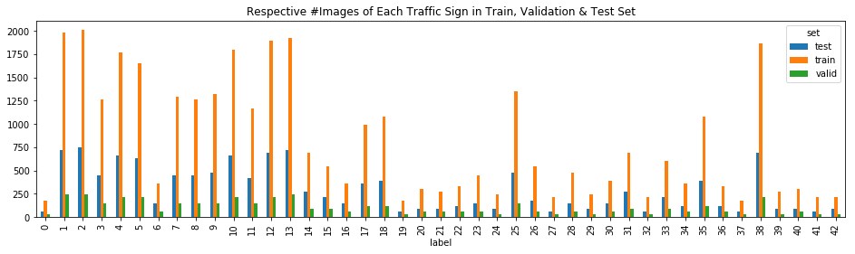

A helper function `rand_img_visualizer` is created to ease visualizing the images in the dataset. The function randomly select and plot a number of images from the input dataset. Running multiple times of the function on each dataset, we can observe the variation of the quality of traffic sign images, i.e. different level of contrast/saturation, blur in motion, sun glare, different angle of view, size of sign and etc. 

> 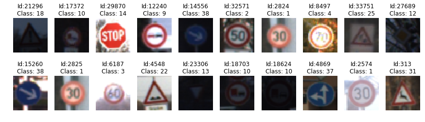
> 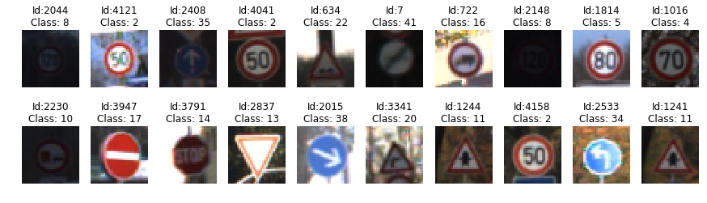


## Design and Test a Model Architecture

### Preprocessing

The first preprocesing technique here is **Normalization**, it is an essential step to condition the input data values centering around zero with equal variance (usually 1). From Vincent Vanhoucke's lecture video, the motivation is for numerical stability and quicker optimization convergence. 

Prior to normalization, **Grayscaling** is  implemented. The decision is based on better accuracy in grayscale images during experimental stage of the LeNet-5 network and this is also further confirmed after the review of the benchmark paper, Sermanet et al. [[1]](http://yann.lecun.com/exdb/publis/pdf/sermanet-ijcnn-11.pdf) 

> 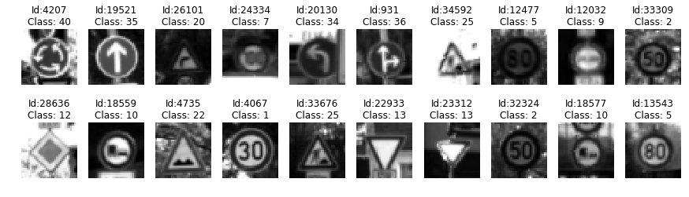
> 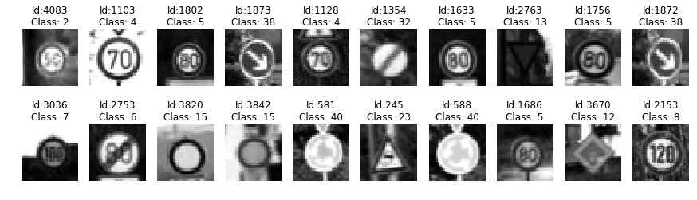

### Data Augmentation

As hinted in the project kit, "generate fake data" means data augmentation. The idea is to generate more training data by applying different transformation and noise to the initial dataset. By introducing variance and more training data, the trained model is usually more robust and can be prevented from overfitting as the statistical invariant parameters will be learned. [[2]](https://cartesianfaith.com/2016/10/06/what-you-need-to-know-about-data-augmentation-for-machine-learning/)

Common techniques of augmentation are *image flipping, rotation, translation, zooming, cropping, color perturbation, random noise addition or even combination of these.* As the alternatives of augmentation are only limited by one's imagination, and since this is a deep learning starter project, it is decided to reference the great work, [Sermanet et al.](http://yann.lecun.com/exdb/publis/pdf/sermanet-ijcnn-11.pdf) The 3 techniques outlined in the paper are

1. **Rotation between -15 to 15 degree** (look up `transform.rotate` in the notebook) 
2. **Translation between -2 to 2 pixel in X-Y position** (look up `transform.warp` or `transform.AffineTransform`)
3. **Zooming between 0.9 and 1.1 ratio** (look up helper function `zoom`)

The implementation can be found in the notebook, the base transformation functions are implemented based on *scikit-image* API. **It is also noted that the transformation parameters are randomly sampled in the range specified above**. With these techniques, in total, we have now 4 times of the initial dataset size.

> 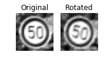
> 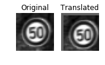
> 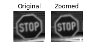


### Model Architecture & Framework

This section mainly discusses the basic architecture and framework helper function designed to allow easy configuration and experimentation. The final model will be described in the *Solution Approach* section.

As a solid starting point, the LeNet-5 architecture is chosen. There are multiple aspects taught during the class are worth investigated to see the incremental effect of accuracy improvement on the LeNet-5 network. Hence, a framework helper function is designed such that there are knobs for changing network architecture. Please find the diagram below. 

> 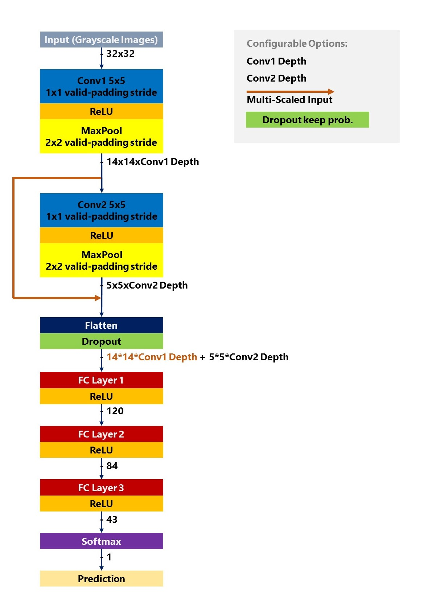

LeNet-5 framework helper function prototype:

```python
def LeNet(x, color_channel=1, conv1_depth=6, conv2_depth=16, multiscale=False, dropout_keep_prob=None): 
```

As Lenet-5 architecture is self-explanatory, the emphasis is given to the design of function which includes the following features:

1. **Color channel** - to allow grayscale vs RGB images as input

2. **Depth of 2D Convolution** -  to allow variable depth of convolution output in both first and second stages

3. **Multi-scale features**
 - This is to enable attempt on the central idea of [Sermanet et al.](http://yann.lecun.com/exdb/publis/pdf/sermanet-ijcnn-11.pdf) paper, where the output of multiple convolution stages are branched out and fed as input to the classifier, it is proven beneficial in the paper. This is disabled by default. Enabling this bool flag means both stages of convolution output are being fed to the classifier. 

4. **Dropout** 
 - This is a regularization technique for reducing overfitting. The technique temporarily and randomly drops hidden units from the network. We only allow dropout at the input layer of the classifier. This bool flag can be enabled or disabled by default.


### Model Training

The loss function to be minimized is an **average of cross entropy** per batch size and the optimizer of choice is **ADAM**, a variant of stochastic gradient descent that uses momentum and learning rate decay. Momentum is a way to determine the direction of descent by averaging historical gradient descent and learning rate decay means taking smaller descent in each iteration. **Random initialization** of the weight matrices is used as it indeed catalyzes the initial learning, proven during course lab and during sketches. In this project, hyperparameter EPOCH, learning rate, batch size are not rigorously explored and only tested during sketches, they are fixed at **EPOCH=50, rate=0.001, and batch_size=128**.


### Solution Approach

The course towards the final model is iterative and empirical, different combination of config in the architecture helper function described above have been carried out. For a fluent flow of conveying the improvement w.r.t each changes, following table records the detail of the models trained in the chronological order. 

#### Results of Models
*Bolded parameters are the change compared to previous model trained.*

| Model ID | Input Data                         | 1st Stage Conv. Depth | 2nd Stage Conv. Depth | Multi-Scale Features | Dropout | Validation Accuracy (%) | Test Accuracy (%) |
|----------|------------------------------------|-----------------------|-----------------------|----------------------|---------|-------------------------|-------------------|
| 0        | Grayscale Images                   | 6                     | 16                    | None                 | None    | 92.4                    | *91.4*              |
| 1        | Grayscale Images                   | **12**                    | **32**                    | None                 | None    | 93.4                    | *91.7*              |
| 2        | **Grayscale Images with Augmentation** | 12                    | 32                    | None                 | None    | 93.1                    | *93.2*              |
| 3        | Grayscale Images with Augmentation | 12                    | 32                    | **Yes**                  | None    | 94.8                    | *94.1*              |
| 4        | Grayscale Images with Augmentation | 12                    | 32                    | Yes                  | **0.90**    | 95.2                    | *94.3*              |


> 1. It is all started with LeNet-5 architecture learned in the course lab. With the initial EPOCH of 10 and learning rate of 0.001, the test accuracy is about 89%. For comparison, some hyperparameters needs to be fixed, learning rate stays 0.001, batch size remains 128, EPOCH is modified to 50 because all the models above are observed to be considered converged at 50. For example, the basic LeNet-5 (model 0) is giving test accuracy of 91-92% at EPOCH 50 and 100.

> 2. Next, the depth of 2 stages convolution is doubled. The idea to see if increase in depth of these hidden layers could improves the test accuracy. Yes, it does, slightly.

> 3. Can more data improve the model robustness? Yes, with augmented data of 4x of initial size, the model is now at 93.2% of test accuracy, hitting the minimum required for the project. There is a caveat observed during the sketches, if the augmenting data is too noisy or high in variance, the model of same architecture may not improve and potentially degrade. For instance, the mirror effect by flipping horizontal or vertically actually causes the model being poorly in the same configuration of hyper-parameters and parameters space here.

> 4. To reproduce the proven improvement in Sermanet et al paper, the multi-scaled feature is introduced by feeding both convolution output to classifier. With that, test accuracy is further improved by 0.9%, i.e. from 93.2 to 94.1. The reasoning is that the classifier has learned the features at different abstraction level, not only the last stage of convolution filter. We can examine later on in the feature map plot.

> 5. The final model includes a dropout at the input of the classifier to prevent overfitting and for generalization. Probability rate of dropping out has been tested, the best result obtained for 50 epochs is with 0.90. **The final test accuracy is 94.3%**. Following is the complete model architecture and it took about 7 mins to train with AWS EC2 g2.2xlarge instance.


#### The Final Model
| Layer                                        | Description                                                                  |
|----------------------------------------------|------------------------------------------------------------------------------|
| Input                                        | 32x32x1 Normalized Grayscale Image with Augmented Data                       |
| First 2D Convolution                           | 5x5 patch with 1x1 stride, valid padding, outputs 28x28x12                   |
| ReLu, followed by Max-pooling                | activation with subsampling of 2x2 stride, outputs 14x14x12                  |
| Second 2D Convolution                           | 5x5 patch with 1x1 stride, valid padding, outputs 10x10x32                   |
| ReLu, followed by Max-pooling                | activation with subsampling of 2x2 stride, outputs 5x5x32                    |
| First fully-connected layer, activated by ReLu | **Flatten multi-scaled input** of length 14\*14\*12 + 5\*5\*32, output of length 120 |
| Second fully-connected layer, activated by ReLu | input of length 120,output of length 84                                     |
| Third fully-connected layer                    | input of length 84,output of length 43                                      |
| Softmax                                      | computation of probability for 43 classes                                    |


### Test Final Model on New Images

It's time to have some fun with the final model. Five new images are acquired from the internet and will be put to test the final model. Preprocessing of cropping & resizing of the raw images are performed before feeding into the model. Following will be an image-by-image walkthrough of rationale of image choice, thier qualities, predicted class and thier softmax output.

> **Test Image 0: Keep right** 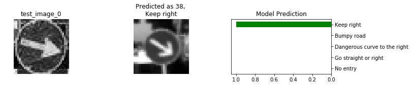 

First, let's choose a sign that has a high number of instances in the data. The reason is that we expect this class to perform well. In the chosen *Keep Right* sign above, the arrow pointing to bottom right is slightly rotated as compared to the real *keep right* sign. But, the classifier is able to classify with a high probability of *keep right* class. However, an interesting test should be carried out because the chosen image can be [*turn right* sign](https://en.wikipedia.org/wiki/Road_signs_in_Germany) which is not part of the dataset here.

> **Test Image 1: Speed limit (20km/h)** 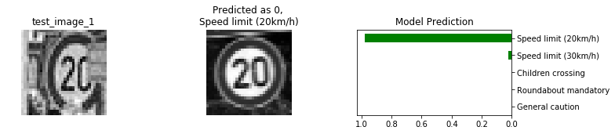 

With reference to the exploratory barplot earlier, this sign is selected because its low count in the dataset. Examing the image, the sign is captured from angle as it looks tilted and the text of *20* is also blocked partially. Despite the variability and low instances, the classifier predicts the image correctly with over 95% of probability.

> **Test Image 2: Mandatory direction of travel** 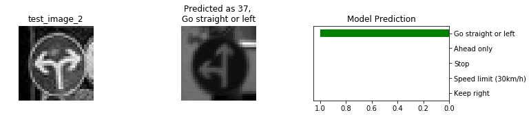 

The model response of external class is the subject of this test. The image is clear and obvious, it is a sign of [*Mandatory direction of travel*](http://www.gettingaroundgermany.info/zeichen.shtml), there is none of this class in the training dataset. The model predicts it to be a sign of *Go straight or left*, which is decent, visually it is the closest match where the left arrow resembles each other. However, a question arises here, why prediction of '*Go straight or* **right**' is not high enough to show as top 5 classes as the right arrow would looks like the one in test image?

> **Test Image 3: Cattle** 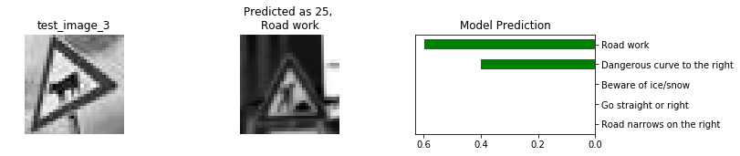 

It will be interesting to try an outrageous angle and external sign, the [*cattle*](https://en.wikipedia.org/wiki/Road_signs_in_Germany) sign is chosen. As the cattle sign is an external class, the warning triangle has been the determining feature and it has resulted in *road work* sign predicted but at a relatively low probability. The second probable predicted sign is *Dangerous curve to the right*. To understand better, we will go through these feature map plot in the following section.   

> **Test Image 4: No equestrians** 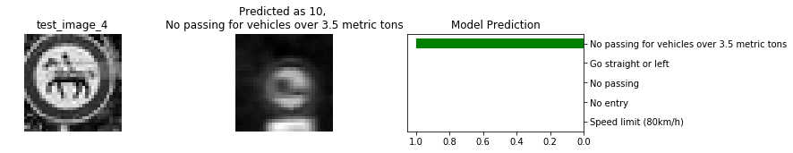 
This is just another external sign, [*No equestrians*](https://en.wikipedia.org/wiki/Road_signs_in_Germany).  As shown above, the predicted sign also has the features like the input image, such as the regulatory circle & the shape of the pattern in the circle. The model seems to have learned to see! 

### Feature Map Plot
To take the model debug a level deeper than the softmax probability, feature map plot is visually helpful. With provided helper function and minor modification, the feature maps of the ReLu of first convolution layer are plotted for **cattle test image & its two-highest probable sign images**. The white pixels means activated, the warning triangle looks to activate the two classes. Also, although they looks shallow, the internal activity within the triangle looks similar for the three of them.

Conv1 Feature Map Plot of *Cattle* Test Image 
> 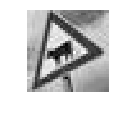
> 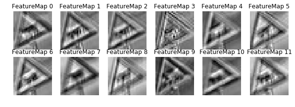

Conv1 Feature Map Plot of highest probable sign *Road Work* 
> 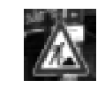
> 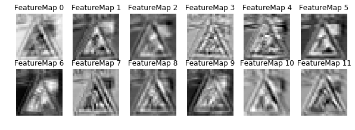

Conv1 Feature Map Plot of the other probable sign *Dangerous curve to the right*
> 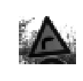
> 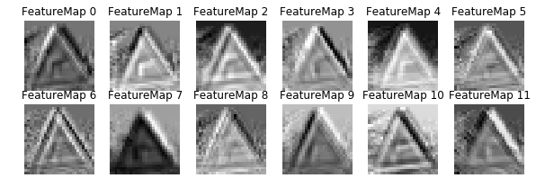
